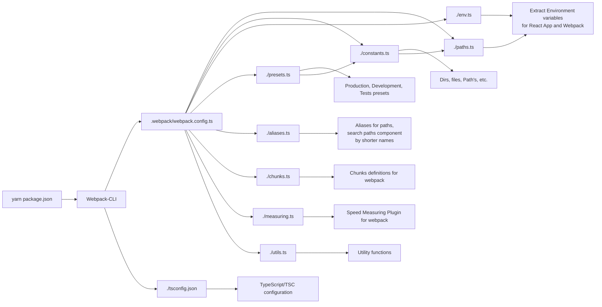

# Webpack Configuration

## How is it Structured?

## Expectations

1. Developer will modify files:
   1. `./aliases.ts` - to add new aliases inside React App
   2. `./env.ts` - modify environment variables definition `KnownReactAppVariables`, declare all used `REACT_APP_*` variables

## Global Variables

TODO: add a description of all global variables that webpack configuration uses during the build process

| Variable                | Description                                                               |
| ----------------------- | ------------------------------------------------------------------------- |
| \_\_dirname             | Current directory path                                                    |
| \_\_filename            | Current file path                                                         |
| NODE_ENV                | Current environment                                                       |
| NODE_OPTIONS            | Global influence on node.js (more memory, ESM or `.env` initializations ) |
| TS_NODE_PROJECT         | Path to `tsconfig.json` (use custom tsconfig name, path)                  |
| IMAGE_INLINE_SIZE_LIMIT | Image size limit for inlining                                             |
| MEASURE                 | Enable/Disable speed measuring plugin                                     |
| PUBLIC_PATH             | Public URL for assets (`public/index.html`)                               |
| CLIENT_ENVIRONMENT      | Environment variables for Webpack (see `./env.ts`)                        |

## Application Global Variables

Variables that are accessible from the React App code

| Variable                     | Description                                          |
| ---------------------------- | ---------------------------------------------------- |
| NODE_ENV                     | Current environment                                  |
| PUBLIC_PATH                  | Public URL for assets (`public/index.html`)          |
| CLIENT_ENVIRONMENT           | Environment variables for Webpack (see `./env.ts`)   |
| REACT_APP_CLIENT_ENVIRONMENT | Environment variables for React App (see `./env.ts`) |

Refs:

- https://typestrong.org/ts-node/docs/options#tsconfig-options
