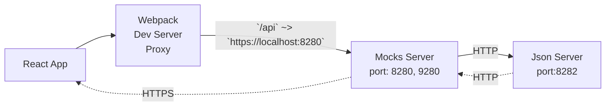

# Webpack.config

- [Webpack.config](#webpackconfig)
  - [Tools](#tools)
    - [Dev Environment Setup](#dev-environment-setup)
  - [Steps](#steps)
    - [0001-use-webpack-for-bundling](./doc/adr/0001-webpack-5-xx-clean-configuration.md)
    - [0002-start-from-node-18-lts](./doc/adr/0002-start-from-node-18-lts.md)
    - [0003-typescript-enabled-solution](./doc/adr/0003-typescript-enabled-solution.md)
    - [0004-enable-typescript-support-in-webpack](./doc/adr/0004-enable-typescript-support-in-webpack.md)
    - [0005-enable-caching-for-webpack](./doc/adr/0005-enable-caching-for-webpack.md)
    - [0006-connect-react-to-project](./doc/adr/0006-connect-react-to-project.md)
    - [0007-enabled-assets-support-for-react-project](./doc/adr/0007-enabled-assets-support-for-react-project.md)
    - [0008-enable-svg-and-fonts-support](./doc/adr/0008-enable-svg-and-fonts-support.md)
    - [0009-enable-css-styles-support](./doc/adr/0009-enable-css-styles-support.md)
    - [0010-collect-metrics-of-the-webpack-configuration](./doc/adr/0010-collect-metrics-of-the-webpack-configuration.md)
    - [0011-enable-esbuild-and-environment-variables-injection](./doc/adr/0011-enable-esbuild-and-environment-variables-injection.md)
    - [0012-customize-html-file-creation](./doc/adr/0012-customize-html-file-creation.md)
    - [0013-proxy-configuration-support](./doc/adr/0013-proxy-configuration-support.md)
    - [0014-cjs-and-esm-modules-mix](./doc/adr/0014-cjs-and-esm-modules-mix.md)
  - [TODO](#todo)

## Tools

### Dev Environment Setup

- [volta](https://docs.volta.sh/guide/understanding)
- [direnv](https://direnv.net/)

## Steps




Export HAR to mocks-server collections/routes:

```bash
# convert HAR file to set of JSON files that mocks-server can automatically load
mocks/scripts/export.har.ts ./mocks/fixtures/16b19ff8-640f-4489-af03-9adff0e902da/recorded.har
```

details: [mocks-server](./mocks/scripts/README.md)

## TODO

- [x] Inject environment variables `REACT_APP_*`
- [x] Define environment variables into webpack
- [x] Support proxy configuration for Dev Server
- [ ] Support Jest
- [ ] Support Cypress
- [ ] Support EsLint
- [ ] Support Prettier
- [ ] Support browserslist
- [ ] Compose a manifest file for the project
