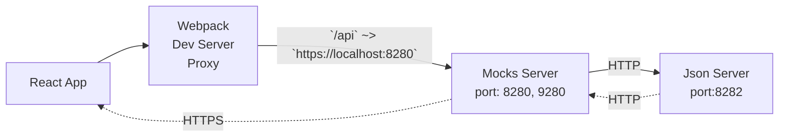

# 13. Proxy configuration Support

Date: 2023-12-03

## Status

Accepted

## Context

Required support of the developer environment where all the requests redirected to proxy server.

## Decision

- [x] install `mocks-server` as a tool in own folder. In case of adding mock-server to the root project dependencies, will be a conflict between CJS and ESM modules.
  - [x] BUN can run `mocks-server` event with a conflict `bun --bun mock-server`
  - [x] Node raise the error `Error [ERR_REQUIRE_ESM]: require() of ES Module ... from ... not supported.` Any attempts to bypass it does not work.
  - [x] mock-server installed as a sub-project, with own `node_modules`, and own package.json In this case Node execute server without any issues.
- [x] installed `json-server` as a developer server that supports GET, POST, PUT, PATCH, DELETE and OPTIONS.
- [x] installed `mkcert` as a tool for creating certificates for localhost.
- [x] `mocks-server` configured to use self-signed certificates, so we can try HTTPS calls from the client side.
- [x] `mocks-server` configured to use `json-server` as a data source, we proxy all calls to `json-server` and add some additional logic to the response.



- [x] `mocks-server` configured to use typescript via `@babel`

## Consequences

```txt
$ /Users/o.kucherenko2/workspace/githubs/webpack.config/node_modules/.bin/mocks-server --help
/Users/o.kucherenko2/workspace/githubs/webpack.config/node_modules/inquirer/lib/utils/screen-manager.js:4
const wrapAnsi = require('wrap-ansi');
                 ^
Error [ERR_REQUIRE_ESM]: require() of ES Module /Users/o.kucherenko2/workspace/githubs/webpack.config/node_modules/wrap-ansi/index.js from /Users/o.kucherenko2/workspace/githubs/webpack.config/node_modules/inquirer/lib/utils/screen-manager.js not supported.
Instead change the require of index.js in /Users/o.kucherenko2/workspace/githubs/webpack.config/node_modules/inquirer/lib/utils/screen-manager.js to a dynamic import() which is available in all CommonJS modules.
    at Object.<anonymous> (/Users/o.kucherenko2/workspace/githubs/webpack.config/node_modules/inquirer/lib/utils/screen-manager.js:4:18)
```

ref: https://github.com/SBoudrias/Inquirer.js/issues/1199

Self-signed certificates for local development:

```bash
cd ./mocks && trap "{ cd ..; }" SIGINT SIGTERM ERR EXIT && yarn json-server --watch ./mocks.json --port 8282

# https://stackoverflow.com/questions/17157721/how-to-get-a-docker-containers-ip-address-from-the-host
docker inspect -f '{{range.NetworkSettings.Networks}}{{.IPAddress}}{{end}}' {container_name}

# list all IPs - docker-compose
docker inspect -f '{{.Name}} - {{range .NetworkSettings.Networks}}{{.IPAddress}}{{end}}' $(docker ps -aq)

# list all IPs - docker
docker inspect -f '{{.Name}} - {{.NetworkSettings.IPAddress }}' $(docker ps -aq)

##
## IF you run servers from docker containers, yo may need to register IPs of containers in your hosts file
##    and generate certificates for those IPs.
##

# create certificates
mkcert --install

# The certificate is at "./local.dev+8.pem" and the key at "./local.dev+8-key.pem" ✅
mkcert local.dev dev.local dev.localhost "*.dev" "*.local" "*.localhost" localhost 127.0.0.1 ::1
```

Custom PROXY handlers, that allows to modify proxy request body and response on errors.

```ts
options: {
  onProxyReq: (proxyReq, req, res) => {
    if (!req.body || !Object.keys(req.body).length) {
      return;
    }
    const contentType = proxyReq.getHeader("Content-Type");
    const writeBody = (bodyData: string) => {
      proxyReq.setHeader("Content-Length", Buffer.byteLength(bodyData));
      proxyReq.write(bodyData);
    };
    if (contentType === "application/json") {
      writeBody(JSON.stringify(req.body));
    }
    if (contentType === "application/x-www-form-urlencoded") {
      writeBody(querystring.stringify(req.body));
    }
  },

  proxyErrorHandler: function (err, res, next) {
    switch (err && err.code) {
      case "ECONNRESET": {
        return res.status(405).send("504 became 405");
      }
      case "ECONNREFUSED": {
        return res.status(200).send("gotcher back");
      }
      default: {
        next(err);
      }
    }
  },
}
```

`webpack.config.ts`: proxy section configuration

```ts
{
  /* ... */
  devServer: {
    proxy: {
      changeOrigin: true,
      toProxy: true,
      // logger: console,
      // ...preset.devServerProxy,
      "/api": {
        // ref: https://github.com/chimurai/http-proxy-middleware#nodejs-17-econnrefused-issue-with-ipv6-and-localhost-705
        target: "https://127.0.0.1:8280",
        pathRewrite: { "^/api": "" },
        secure: false,
        logLevel: "debug",
        onProxyReq: (proxyReq, req, res) => {
          debug(
            "proxy: %s %s ~> %s//%s:%d%s",
            proxyReq.method,
            req.url,
            proxyReq.protocol,
            proxyReq.host,
            8280,
            proxyReq.path
          );
          // debug("proxy: %O", proxyReq);
        },
        onError: (err, req, res) => {
          debug("proxy: %O", err);
        },
      },
    },
  },
  /* ... */
}
```

Register custom domain `local.dev` for localhost

```bash
sudo gsed -i '1i 127.0.0.1  local.dev' /etc/hosts
sudo gsed -i '1i 127.0.0.1  dev.local' /etc/hosts
sudo gsed -i '1i 127.0.0.1  dev.localhost' /etc/hosts

```

### Dependencies

```json
{
  "devDependencies": {
    // Mocks Server's with Typescript support
    "@babel/preset-env": "^7.23.5",
    "@babel/preset-typescript": "^7.23.3",
    "@mocks-server/main": "^4.1.0",
    "json-server": "^0.17.4"
    // Tools
    "patch-package": "^8.0.0",
    "concurrently": "^8.2.2",
  },
  "scripts": {
    // patching tool
    "postinstall": "patch-package && ( yarn --silent --cwd ./mocks )"
    // run mocks-server and json-server
    "dev:sjson": "yarn --cwd ./mocks dev:sjon",
    "dev:mocks": "yarn --cwd ./mocks dev:mocks",

    "start:dev": "concurrently --kill-others --prefix-colors 'blue,green' \"npm:dev:*\"",
    "dev:mocks": "mocks-server --server.port 8280 --plugins.adminApi.port 9280",
    "dev:sjson": "json-server --watch jsrv.mocks.json --routes ./jsrv.routes.json --port 8282"
  }
}
```

### References

- https://www.mocks-server.org/docs/installation/
- https://nodejs.org/api/esm.html#esm_differences_between_es_modules_and_commonjs
  - [Import Map Loader](https://gist.github.com/wesleytodd/4399b2351c59438db19a8ffb1f3fcdca)
  - https://gist.github.com/sindresorhus/a39789f98801d908bbc7ff3ecc99d99c - Pure ESM package explanation
  - https://github.com/node-loader/node-loader-import-maps
- https://www.npmjs.com/package/webpack-mock-server
- https://www.mock-server.com/#what-is-mockserver
- https://www.mocks-server.org/docs/guides/using-babel/#typescript - Enable Typescript support for Mock-Server
- https://words.filippo.io/mkcert-valid-https-certificates-for-localhost/ - HTTPS Certificates for localhost
  - https://blog.cdivilly.com/2020/06/15/localhost-wildcard_https
- https://github.com/typicode/json-server
  - https://github.com/typicode/json-server#cli-usage
- https://github.com/chimurai/http-proxy-middleware/issues/320
- https://github.com/villadora/express-http-proxy
- https://github.com/chimurai/http-proxy-middleware#nodejs-17-econnrefused-issue-with-ipv6-and-localhost-705
  - https://github.com/nodejs/node/issues/40702 - Unable to connect to establish a TCP connection (ECONNREFUSED)
- https://github.com/open-cli-tools/concurrently - Run commands concurrently.
- https://emmapopoola.medium.com/setting-up-a-custom-domain-for-your-local-apps-mac-os-linux-c68798722143
- https://github.com/typicode/hotel - Start apps from your browser and use local domains/https automatically.
