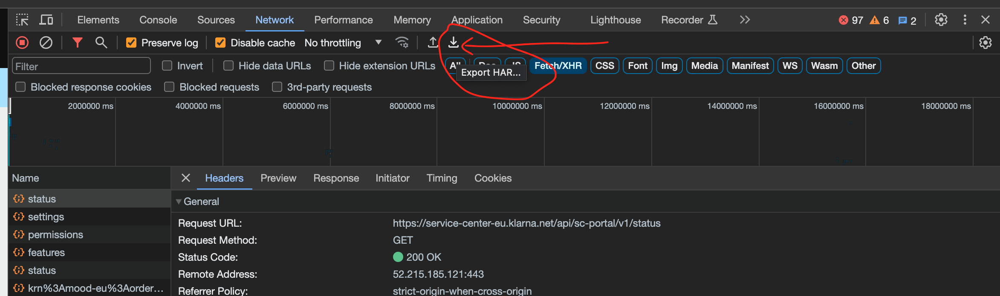

# HOW to convert HAR to mock JSON

- [HOW to convert HAR to mock JSON](#how-to-convert-har-to-mock-json)
  - [How to capture the HAR](#how-to-capture-the-har)
  - [Usage](#usage)
  - [Data Extraction](#data-extraction)
    - [Domains](#domains)
    - [URLs](#urls)
    - [References:](#references)

## How to capture the HAR

To get HAR file:

- Open Google Chrome Dev Tools on the page (F12)
- Go to "Network Tab"
- Right click -> Copy -> Copy all as HAR
- Paste into a new JSON file, OR:

```bash
# On Mac: paste clipboard into a file
pbpaste >mocks/fixtures/16b19ff8-640f-4489-af03-9adff0e902da/recorded.har
```

> WARNING: HAR file in this way will contain responses without body. To get full HAR with responses body
> you will need to press Dev Tools button "Export HAR..." and select the place fo it. File size should be
> huge, around ~30-40Mb.



## Usage

```bash
# you should be in the root folder of the project

# Results of scripts will be in folder of HAR file
# ./mocks/fixtures/16b19ff8-640f-4489-af03-9adff0e902da

# extract source URL from HAR and make a link file from it, so dev can open the source easily
mocks/scripts/extract.url.sh ./mocks/fixtures/16b19ff8-640f-4489-af03-9adff0e902da/recorded.har

# now its time to convert HAR to set of JSON files
mocks/scripts/export.har.ts ./mocks/fixtures/16b19ff8-640f-4489-af03-9adff0e902da/recorded.har
```

```text
  export:har processing file: './mocks/fixtures/16b19ff8-640f-4489-af03-9adff0e902da/recorded.har' +0ms
  export:har include failed entries: true +1ms
  export:har enabled debug info: false +0ms
  export:har total HAR entries: 133 +198ms
  export:har source url: https://example.com/server +1ms
  export:har "application/json" entries: 85 +1ms
  export:har searching for unique entries... +0ms
  export:har detected repeated entries: 37 +9ms
  export:har mapped entries: 48 +24ms
  export:har output mapping file: "./mocks/fixtures/16b19ff8-640f-4489-af03-9adff0e902da/mapping.json" +0ms

./mocks/scripts/export.har.ts --help
export.har.ts <file>

Converts a HAR (Html ARchive) file to a collection of JSON files

Options:
  --file     HAR file to convert                             [string] [required]
  --failed   extract failed entries                    [boolean] [default: true]
  --debug    enable debug logs                        [boolean] [default: false]
  --version  Show version number                                       [boolean]
  --help     Show help                                                 [boolean]
```

## Data Extraction

```bash
# extract source of data from HAR
jq --raw-output ".log.pages[0].title" ./recorded.har

# extract methods used for requests from HAR
jq '.log.entries[] | .request.method' ./recorded.har | sort | uniq

# extract all requests URLs from HAR that returns HTML
jq -r '.log.entries[] | select(.response.content.mimeType | contains("text/html")) | .request.url' ./recorded.har

# get list of mime-types from HAR
jq -r '.log.entries[] | .response.content.mimeType' ./recorded.har | sort | uniq

# get list of URLs that return JSON
jq -r '.log.entries[] | select(.response.content.mimeType | contains("application/json")) | .request.url' ./recorded.har

# get method and URL of all requests that return JSON
jq -r '.log.entries[] | select(.response.content.mimeType | contains("application/json")) | { method: .request.method, url: .request.url }' ./recorded.har

# get method and URL of all GET requests that return JSON
jq -r '.log.entries[] | select(.response.content.mimeType | contains("application/json")) | select(.request.method | contains("GET")) | { method: .request.method, url: .request.url }' ./recorded.har

# get list of GET URLs that return JSON, sorted and unique
jq -r '.log.entries[] | select(.response.content.mimeType | contains("application/json")) | select(.request.method | contains("GET")) | .request.url' ./recorded.har | sort | uniq

```

### Domains

```bash
nslookup scp-klapp-eu.klarna.net
> web.production.eu1.scp-klapp-gateway.klarna.net.

nslookup service-center-eu.klarna.net
> websites-gateway.production.eu1.klear.klarna.net.
```

### URLs

Convert URLs to unique file names.

Output pattern: `${simplified_url}-${query_params_hash}`

simplified_url: `${service}-${dash_separated_path}`

- remove protocol, domain, port
- remove part of the path (e.g. `/api/`)

dash_separated_path:

- replace data by patterns: `16b19ff8-640f-4489-af03-9adff0e902da` ~ `uuid`
- replace data by patterns: `16b19ff8-640f-4489-af03-9adff0e902da_99957e3e-5500-418b-9441-67a830844d40` ~ `uuid_uuid`
- replace data by patterns: `krn%3Amood-eu%3Acapture%3A99957e3e-5500-418b-9441-67a830844d40` ~ `krn:*:*:id` ~ `krn`
- replace `/` with `-`
- remove `v1` from path, but keep `v2` and `v10`

query_params_hash:

- short sha1 (or md5) hash of query params string (6 chars or 12 chars)

Script execution produces file `.mapping.json` that map filename to original URL. Due to using hash and simplification of the URL, there can be hards to understand which url we use as input.

```json
[
  ["filename", "URL"],
  ["sc-portal-status.json", "https://service-center-eu.klarna.net/api/sc-portal/v1/status"],
  [
    "websites-service-center-portal-manifest.json.json",
    "https://service-center-eu.klarna.net/websites/service-center-portal/manifest.json"
  ],
  ["sc-portal-settings.json", "https://service-center-eu.klarna.net/api/sc-portal/v1/settings"],
  ["sc-portal-permissions.json", "https://service-center-eu.klarna.net/api/sc-portal/v1/permissions"],
  ["sc-portal-features.json", "https://service-center-eu.klarna.net/api/sc-portal/v1/features"],
  [
    "de-orders-bff-transactions-internal-uuid-uuid-initialdata.json",
    "https://scp-klapp-eu.klarna.net/de/api/orders_bff/v1/transactions/internal/16b19ff8-640f-4489-af03-9adff0e902da_99957e3e-5500-418b-9441-67a830844d40/initialData"
  ],
  [
    "de-orders-bff-transactions-internal-uuid-uuid-59f73e4f.json",
    "https://scp-klapp-eu.klarna.net/de/api/orders_bff/v1/transactions/internal/16b19ff8-640f-4489-af03-9adff0e902da_99957e3e-5500-418b-9441-67a830844d40?darkMode=false"
  ]
]
```

Forbidden chars in the output file names:

```text
< (less than)
> (greater than)
: (colon - sometimes works, but is actually NTFS Alternate Data Streams)
" (double quote)
/ (forward slash)
\ (backslash)
| (vertical bar or pipe)
? (question mark)
* (asterisk)
```

ref: [forbidden chars in file name](https://stackoverflow.com/a/31976060)

### References:

- https://lorefnon.me/2020/11/27/exploring-har-http-archive-logs-with-jq/
- https://github.com/Pixboost/har-jq-cheatsheet
- https://jqlang.github.io/jq/manual/
